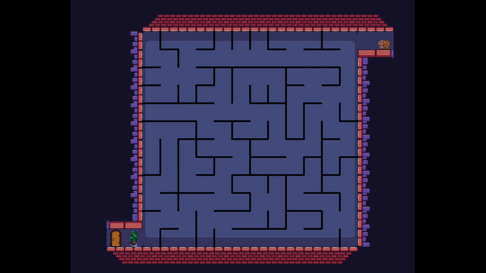

# Blue-Maze

Take the control of an **adventurous orc** traversing through a **2D labyrinth**. The objective? Find and hit the chest to recover the **hidden treasure**. Your journey won't be the same twice as the maze is **randomly generated** each time you play, providing unique and compelling challenges every run.

</br>

<p align="center">
  
</p>

## Technical Stack

The game is developed using **Rust** with **[Bevy](https://bevyengine.org/)**, a refreshingly simple data-driven game engine built in Rust. 

## Algorithmic Foundation: Kruskal's Algorithm

To keep your experience fresh and engaging, the maze in Blue-Maze is randomly generated in every session. This is made possible by **[Kruskal's Algorithm](https://en.wikipedia.org/wiki/Kruskal%27s_algorithm)** (randomized version).

The walls generation function works with the **[rand](https://docs.rs/rand/latest/rand/)** library.

<p align="center">
  
</p>

Every turn, a box and a direction are chosen randomly thanks to the ***rand::thread_rng()*** method. The goal is to generate **isize** (natural number) within \[0, *N*\[ where *N* represents the total number of boxes depending on the map's size and [0, 3] presuming 4 to be the number of walls in a 2D space.

The ***thread_rng()*** method uses a PRNG algorithm **ChaCha block cipher with 12 pounds** made to be strong and unpredictable.

## Installation Instructions

Follow these instructions to get the game up and running on **your local machine**:

1. Ensure you have [Rust installed](https://www.rust-lang.org/tools/install) on your system.

2. Clone this repository:
   ```
   git clone https://github.com/hyzzer/blue_maze.git
   ```

3. Navigate into the game's directory:
   ```
   cd blue-maze
   ```

4. Build and run the game:
   ```
   cargo run
   ```
   
After the build process is complete, you should be able to see the game window pop up and you can start playing Blue-Maze!

**Note:** The game might take some time to compile depending on your system.
